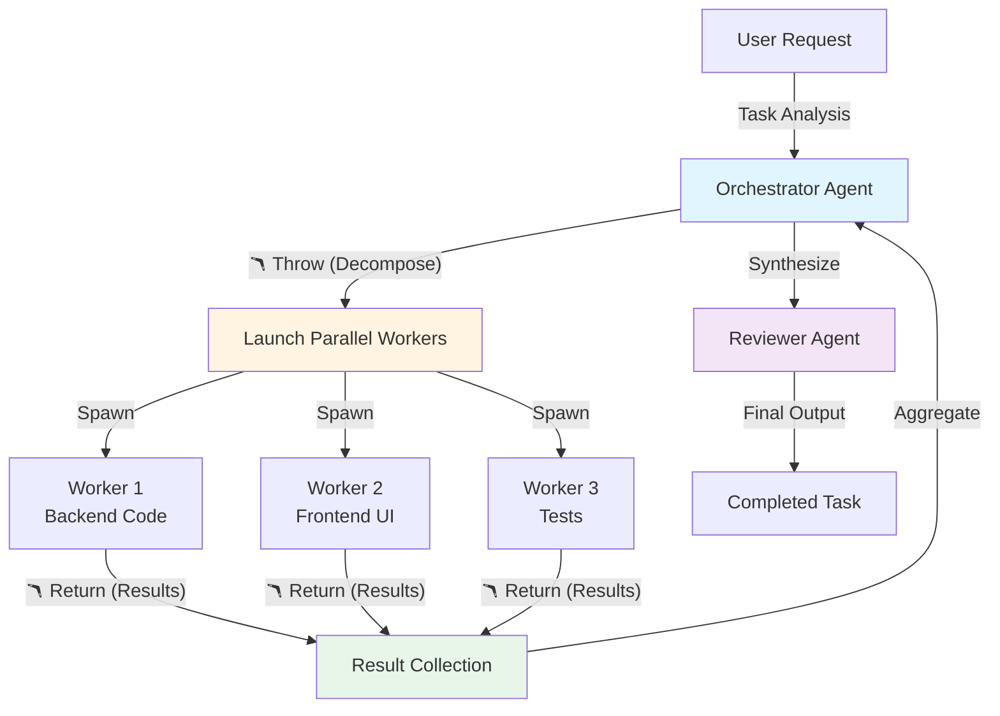
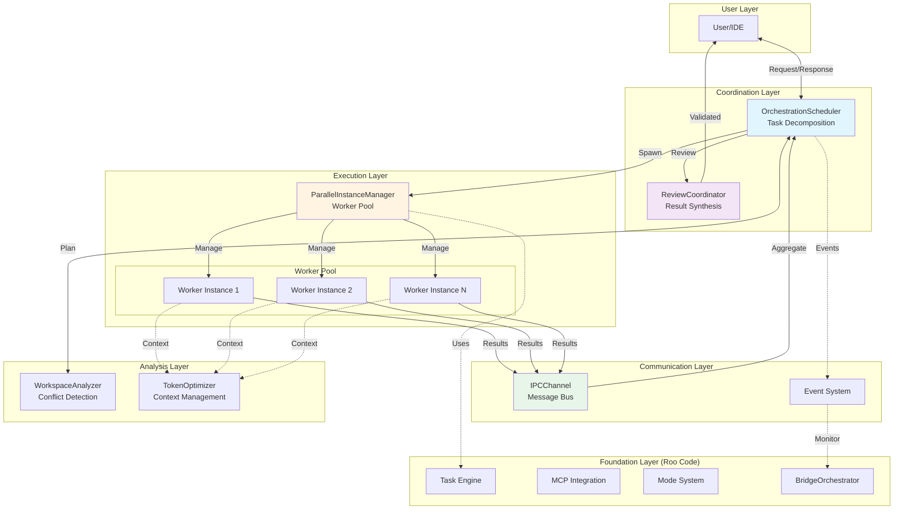
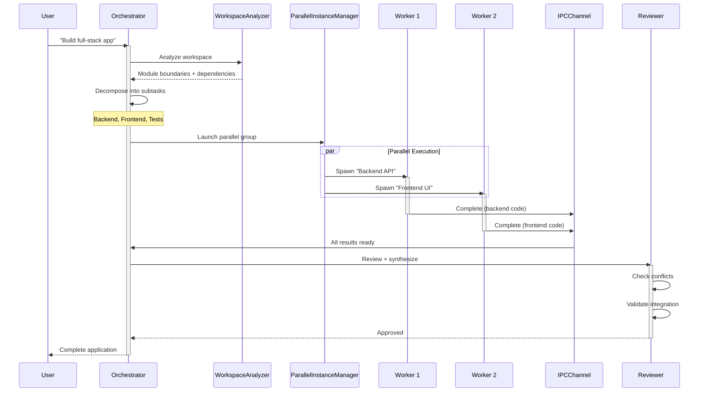
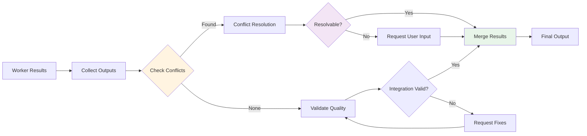
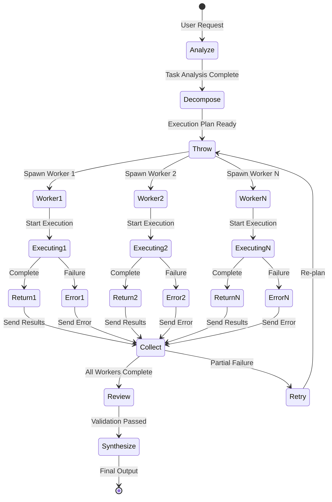
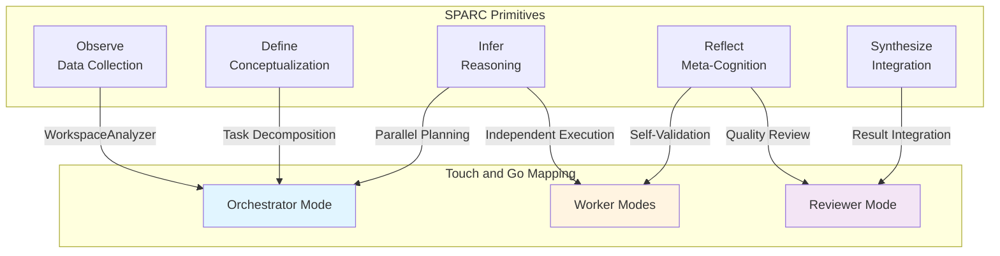
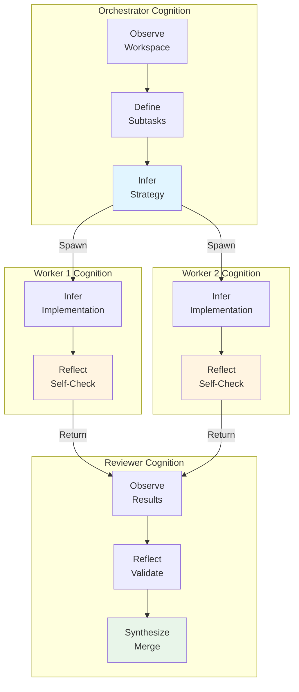
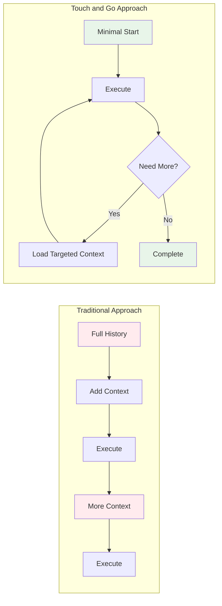

# Touch and Go: Parallel Multi-Agent AI Framework

> **A novel architecture for parallel execution of AI agents with intelligent coordination, built on the SPARC cognitive framework**

[](LICENSE)
[](#sparc-framework-integration)
[](#implementation-roadmap)

## Table of Contents

- [Overview](#overview)
- [The Problem](#the-problem)
- [The Touch and Go Solution](#the-touch-and-go-solution)
- [Architecture](#architecture)
- [Core Components](#core-components)
- [The Boomerang Pattern](#the-boomerang-pattern)
- [SPARC Framework Integration](#sparc-framework-integration)
- [Token Optimization Strategy](#token-optimization-strategy)
- [Comparison with Existing Frameworks](#comparison-with-existing-frameworks)
- [Implementation Approach](#implementation-approach)
- [Getting Started](#getting-started)

---

## Overview

**Touch and Go** is a next-generation multi-agent AI framework designed for parallel execution of specialized AI agents with intelligent task coordination. Built on the proven [SPARC cognitive framework](https://github.com/Mnehmos/Advanced-Multi-Agent-AI-Framework), it introduces a revolutionary "boomerang pattern" for task orchestration that enables true parallel processing while maintaining coherent, coordinated outcomes.

### Key Innovations

🚀 **Parallel Execution**: Multiple AI agents work simultaneously on independent subtasks  
🪃 **Boomerang Pattern**: Structured task decomposition and result aggregation  
🧠 **SPARC Integration**: Cognitive primitives for systematic reasoning  
⚡ **Token Optimization**: Intelligent context management across agent boundaries  
🔄 **Non-Blocking Operations**: Agents spawn, execute, and return results asynchronously

### Built On

This architecture extends [Roo Code](https://github.com/RooCodeInc/Roo-Code), leveraging its robust task management, MCP integration, and mode system while adding parallel execution capabilities.

---

## The Problem

Current multi-agent AI frameworks face critical limitations:

### Sequential Bottlenecks

```
User Request → Agent 1 (wait) → Agent 2 (wait) → Agent 3 (wait) → Result
                  ↓3min            ↓4min            ↓2min
              Total: 9 minutes for interdependent tasks
```

### Context Window Explosion

- Agents inherit full conversation history
- Token usage grows exponentially with task depth
- Performance degrades as context accumulates

### Coordination Chaos

- No standardized pattern for task decomposition
- Result aggregation is ad-hoc
- Error handling across agents is fragile

### Resource Inefficiency

- Single-threaded execution wastes compute capacity
- No intelligent work distribution
- Can't leverage multiple API providers simultaneously

---

## The Touch and Go Solution

Touch and Go introduces a **hybrid parallel-sequential execution model** with intelligent coordination:

### Parallel Execution Model

```
                        ┌─────────────┐
                        │ Orchestrator│
                        │   (Parent)  │
                        └──────┬──────┘
                               │
                ┌──────────────┼──────────────┐
                ▼              ▼              ▼
          ┌─────────┐    ┌─────────┐    ┌─────────┐
          │Worker 1 │    │Worker 2 │    │Worker 3 │
          │(Backend)│    │Frontend │    │  Tests  │
          └────┬────┘    └────┬────┘    └────┬────┘
               │              │              │
               └──────────────┼──────────────┘
                              ▼
                        ┌──────────┐
                        │ Reviewer │
                        │(Synthesis)│
                        └──────────┘

Result: 3 minutes (max of parallel tasks) + coordination overhead
```

### The Boomerang Pattern

Every parallel operation follows a standardized lifecycle:



**🪃 Throw Phase**: Orchestrator analyzes task and spawns specialized workers  
**⚙️ Execute Phase**: Workers operate independently in parallel  
**🪃 Return Phase**: Results boomerang back to orchestrator  
**🔄 Synthesize Phase**: Reviewer validates and integrates outputs

---

## Architecture

### High-Level System Architecture



### Component Interaction Flow



---

## Core Components

### 1. ParallelInstanceManager

**Purpose**: Manages the lifecycle of parallel worker instances

**Key Responsibilities**:

- Spawn multiple task instances concurrently
- Track active worker pool separate from sequential stack
- Coordinate completion via event system
- Resource cleanup and memory management

**API Interface**:

```typescript
interface ParallelInstanceManager {
	// Spawn a new parallel worker
	spawnTask(config: ParallelTaskConfig): Promise<Task>

	// Wait for all workers in a group
	waitForGroup(groupId: string, strategy: "all" | "race", timeoutMs?: number): Promise<Map<string, TaskResult>>

	// Retrieve any task by ID
	getTask(taskId: string): Task | undefined

	// Abort parallel group
	abortGroup(groupId: string): Promise<void>
}
```

**Technical Approach**:

- Maintains `Map<string, Task>` for parallel workers
- Reuses existing `Task` constructor (95% code reuse)
- Event-driven completion detection
- No modifications to core task execution engine

---

### 2. IPCChannel

**Purpose**: Reliable message passing between orchestrator and workers

**Key Responsibilities**:

- Route messages by task ID
- Handle task-specific approvals/denials
- Aggregate results from multiple workers
- Maintain message ordering guarantees

**Message Flow**:

```typescript
// User approval routing
{
    type: "askResponse",
    taskId: "worker-2-id",  // Routes to specific worker
    askResponse: "yesButtonClicked",
    text?: "Additional context"
}

// Result aggregation
{
    operationId: "build-fullstack-app",
    results: {
        "backend-worker": { files: [...], tokens: {...} },
        "frontend-worker": { files: [...], tokens: {...} },
        "test-worker": { files: [...], tokens: {...} }
    }
}
```

**Foundation**:

- Extends existing webview message system
- Leverages `BridgeOrchestrator` for cloud sync
- Backward compatible with single-task routing

---

### 3. OrchestrationScheduler

**Purpose**: Intelligent task decomposition and parallel execution planning

**Key Responsibilities**:

- Analyze task complexity and decomposability
- Determine optimal parallel strategy
- Schedule worker spawning based on dependencies
- Monitor progress and handle failures

**Scheduling Strategies**:

```typescript
type ParallelStrategy =
	| { type: "all"; timeoutMs?: number } // Wait for all workers
	| { type: "race" } // First to complete wins
	| { type: "sequential" } // Fallback for dependencies

interface ExecutionPlan {
	strategy: ParallelStrategy
	workers: Array<{
		description: string
		mode: string
		targetFiles: string[]
		dependencies: string[] // Must complete before spawning
	}>
	estimatedTime: number
	tokenBudget: number
}
```

**Intelligence Features**:

- **Dependency Analysis**: Detects when tasks must be sequential
- **Conflict Detection**: Prevents concurrent edits to same files
- **Dynamic Adjustment**: Adapts strategy based on worker performance
- **Fallback Support**: Reverts to sequential on failures

---

### 4. WorkspaceAnalyzer

**Purpose**: Analyze codebase structure to enable safe parallel execution

**Key Responsibilities**:

- Identify module boundaries and dependencies
- Detect potential edit conflicts
- Suggest optimal task decomposition
- Validate parallel execution safety

**Analysis Capabilities**:

```typescript
interface WorkspaceAnalysis {
	// Module structure
	modules: Array<{
		name: string
		files: string[]
		dependencies: string[] // Other module names
	}>

	// Parallel safety check
	conflictAnalysis: {
		safeForParallel: boolean
		conflicts: Array<{
			file1: string
			file2: string
			reason: "same_file_edit" | "shared_dependency"
		}>
	}

	// Decomposition suggestions
	suggestedSubtasks: Array<{
		description: string
		targetFiles: string[]
		mode: string
		estimatedComplexity: "low" | "medium" | "high"
	}>
}
```

**Safety Guarantees**:

- Pre-flight conflict detection before spawning workers
- Real-time monitoring of file access patterns
- Automatic fallback to sequential if conflicts detected

---

### 5. ReviewCoordinator

**Purpose**: Validate and synthesize parallel worker results

**Key Responsibilities**:

- Detect conflicts between worker outputs
- Validate integration points
- Merge results with conflict resolution
- Quality assurance across parallel workstreams

**Review Process**:



**Conflict Resolution**:

- **Automatic**: Non-overlapping file edits, complementary changes
- **Semi-automatic**: Suggest resolutions based on context
- **Manual**: Request user decision for complex conflicts

---

## The Boomerang Pattern

The boomerang pattern is the core coordination mechanism that ensures reliable parallel execution.

### Pattern Lifecycle



### Throw Phase: Task Decomposition

**Orchestrator Responsibilities**:

1. Analyze task complexity and scope
2. Identify independent subtasks
3. Determine optimal parallel strategy
4. Spawn workers with specific instructions

**Example Decomposition**:

```yaml
original_task: "Build a full-stack todo application"

decomposed_subtasks:
    - id: "backend-api"
      description: "Create REST API with database"
      mode: "code"
      target_files: ["src/api/**", "src/models/**"]
      estimated_time: "4 minutes"

    - id: "frontend-ui"
      description: "Build React components and pages"
      mode: "code"
      target_files: ["src/components/**", "src/pages/**"]
      estimated_time: "3 minutes"

    - id: "integration-tests"
      description: "Write E2E tests"
      mode: "test"
      target_files: ["tests/**"]
      dependencies: ["backend-api", "frontend-ui"]
      estimated_time: "2 minutes"

strategy: "all" # Wait for all to complete
estimated_total: "5 minutes" # Max(4,3) + 2 (sequential dependency)
```

### Return Phase: Result Collection

**Worker Completion Contract**:

```typescript
interface TaskResult {
	taskId: string
	success: boolean
	messages: ClineMessage[] // Conversation history
	tokenUsage: TokenUsage
	toolUsage: ToolUsage
	filesModified: string[]
	error?: string
	checkpointHash?: string // For rollback
}
```

**Orchestrator Aggregation**:

```typescript
// Collect all worker results
const results = await parallelManager.waitForGroup(
	operationId,
	{ type: "all", timeoutMs: 300000 }, // 5 min timeout
)

// Aggregate metrics
const totalTokens = sumTokenUsage(results)
const totalFiles = uniqueFiles(results)

// Check for failures
const failures = Array.from(results.values()).filter((r) => !r.success)

if (failures.length > 0) {
	// Handle partial failure
	await handlePartialFailure(failures, results)
}
```

### Synthesize Phase: Result Integration

**Reviewer Validation**:

```typescript
// Check for conflicts
const conflicts = await reviewCoordinator.detectConflicts(results)

if (conflicts.hasConflicts) {
	// Attempt automatic resolution
	const resolved = await reviewCoordinator.resolveConflicts(conflicts, { strategy: "automatic" })

	if (resolved.unresolvedConflicts.length > 0) {
		// Escalate to user
		await requestUserResolution(resolved.unresolvedConflicts)
	}
}

// Validate integration points
const integrationValid = await reviewCoordinator.validateIntegration(results)

// Merge results
const finalOutput = await reviewCoordinator.mergeResults(results)
```

---

## SPARC Framework Integration

Touch and Go builds on the SPARC (Specification, Pseudocode, Architecture, Refinement, Completion) framework's cognitive primitives for structured reasoning.

### SPARC Cognitive Primitives



### Mode Specialization

Touch and Go introduces three specialized modes:

#### 1. Orchestrator Mode

**SPARC Process**: `Observe → Define → Infer → (Parallel Launch)`

```typescript
roleDefinition: `
You are the Orchestrator, responsible for intelligent task decomposition
and parallel execution coordination. Your cognitive process:

1. OBSERVE: Analyze the workspace structure, dependencies, and task scope
2. DEFINE: Conceptualize independent subtasks that can run in parallel
3. INFER: Determine optimal execution strategy and resource allocation
4. LAUNCH: Spawn specialized workers with precise instructions
5. SYNTHESIZE: Coordinate result collection and review process

Use the spawn_parallel_instance tool to launch workers.
Monitor progress and handle failures gracefully.
`

tools: [
	"spawn_parallel_instance",
	"wait_for_parallel_group",
	"abort_parallel_group",
	"workspace_analysis",
	"read_file",
	"search_files",
]
```

#### 2. Worker Modes (Specialized)

**SPARC Process**: `Infer → Execute → Reflect`

Each worker operates independently with task-specific context:

```typescript
// Code Worker
mode: "code"
context: "Backend API implementation only"
targetFiles: ["src/api/**"]

// Test Worker
mode: "test"
context: "E2E test suite creation"
targetFiles: ["tests/**"]

// Design Worker
mode: "design-engineer"
context: "UI components and styling"
targetFiles: ["src/components/**", "src/styles/**"]
```

#### 3. Reviewer Mode

**SPARC Process**: `Observe → Reflect → Synthesize`

```typescript
roleDefinition: `
You are the Reviewer, responsible for validating and integrating
outputs from parallel workers. Your cognitive process:

1. OBSERVE: Collect all worker results and examine outputs
2. REFLECT: Analyze for conflicts, quality issues, integration problems
3. INFER: Determine resolution strategies for any conflicts
4. SYNTHESIZE: Merge results into coherent final output

Ensure quality standards and integration correctness.
`

tools: ["detect_conflicts", "validate_integration", "merge_results", "read_file", "apply_diff"]
```

### Cognitive Process Flow



---

## Token Optimization Strategy

Token efficiency is critical for parallel execution. Touch and Go implements multi-level optimization.

### Context Isolation

**Problem**: Traditional multi-agent systems pass full conversation history to each agent.

**Solution**: Workers receive only relevant context.

```typescript
// Orchestrator context (full)
conversationHistory: [
    { role: "user", content: "Build full-stack todo app" },
    { role: "assistant", content: "I'll decompose this into..." },
    // 50+ messages of planning and analysis
]

// Worker context (isolated)
backendWorker.conversationHistory: [
    { role: "system", content: "You are implementing the backend API..." },
    { role: "user", content: "Create REST endpoints for todo CRUD operations" }
    // Only relevant context, no orchestrator planning
]
```

**Token Savings**: ~75% reduction per worker

### Workspace Filtering

Workers receive filtered workspace views:

```typescript
interface WorkspaceView {
    targetFiles: string[]      // Only files relevant to task
    dependencies: string[]      // Direct dependencies only
    context: {
        relatedModules: string[]
        apiContracts?: string
        testRequirements?: string
    }
}

// Backend worker sees:
{
    targetFiles: ["src/api/**", "src/models/**"],
    dependencies: ["package.json", "database.schema.sql"],
    context: {
        relatedModules: ["authentication", "validation"],
        apiContracts: "REST API using Express.js"
    }
}
// Does NOT see: frontend code, test files, documentation
```

**Token Savings**: ~60% reduction in environment details

### Progressive Context Loading



Workers start with minimal context and request additional information only when needed:

```typescript
// Initial context (compact)
worker.context = {
	task: "Implement user authentication API",
	constraints: ["Use JWT", "bcrypt for password hashing"],
	targetFiles: ["src/api/auth.ts"],
}

// If worker needs more information:
await worker.expandContext({
	type: "dependency_info",
	module: "user-model",
})
// Loads only requested context, not entire codebase
```

### Result Compression

Orchestrator receives compressed results:

```typescript
interface CompressedResult {
	taskId: string
	summary: string // High-level summary
	filesModified: string[] // File list only
	keyChanges: Array<{
		// Highlights, not full code
		file: string
		description: string
	}>
	metrics: TokenUsage
	fullDetails?: string // On-demand expansion
}

// Instead of sending full conversation history
result = {
	summary: "Implemented authentication API with JWT and bcrypt",
	filesModified: ["src/api/auth.ts", "src/middleware/auth.ts"],
	keyChanges: [
		{ file: "auth.ts", description: "Added login, register, refresh endpoints" },
		{ file: "middleware/auth.ts", description: "Added JWT verification middleware" },
	],
	metrics: { inputTokens: 2500, outputTokens: 1200 },
	// fullDetails loaded only if review needs deep inspection
}
```

### Token Budget Allocation

```typescript
interface TokenBudget {
	total: number // Total available tokens
	orchestration: number // Reserved for planning
	perWorker: number // Per-worker allocation
	review: number // Reserved for synthesis
	buffer: number // Safety margin
}

// Example allocation for 100k token budget
budget = {
	total: 100000,
	orchestration: 15000, // 15% for planning
	perWorker: 25000, // 25k per worker (3 workers = 75k)
	review: 8000, // 8% for review
	buffer: 2000, // 2% safety
}

// Monitors usage in real-time
if (worker.tokenUsage > budget.perWorker) {
	await orchestrator.adjustStrategy({
		action: "reduce_scope" | "abort_worker",
	})
}
```

### Aggregate Savings

```
Traditional Sequential:
├─ Task 1: 20k context + 15k response = 35k
├─ Task 2: 55k context + 18k response = 73k (includes Task 1)
└─ Task 3: 91k context + 20k response = 111k (includes Task 1+2)
Total: 219k tokens

Touch and Go Parallel:
├─ Orchestrator: 15k planning
├─ Worker 1: 8k context + 15k response = 23k (isolated)
├─ Worker 2: 7k context + 18k response = 25k (isolated)
├─ Worker 3: 9k context + 20k response = 29k (isolated)
└─ Reviewer: 12k synthesis
Total: 104k tokens (52% savings)
```

---

## Comparison with Existing Frameworks

### vs. LangGraph

| Feature                | LangGraph                  | Touch and Go                           |
| ---------------------- | -------------------------- | -------------------------------------- |
| **Execution Model**    | Sequential graph traversal | Parallel with boomerang coordination   |
| **State Management**   | Shared mutable state       | Isolated per-worker state              |
| **Error Recovery**     | Retry nodes                | Orchestrator-level strategy adjustment |
| **Tool Calling**       | Per-node basis             | Full tool suite per worker             |
| **Context Management** | Graph-wide context         | Isolated worker contexts               |

**Key Difference**: LangGraph excels at sequential workflows with complex branching. Touch and Go enables true parallel execution of independent tasks.

### vs. AutoGPT/BabyAGI

| Feature                | AutoGPT                | BabyAGI               | Touch and Go           |
| ---------------------- | ---------------------- | --------------------- | ---------------------- |
| **Task Decomposition** | Recursive single agent | Task list management  | Parallel decomposition |
| **Memory**             | Vector store           | Pinecone database     | Per-worker isolated    |
| **Execution**          | Sequential with loops  | Sequential task queue | Parallel workers       |
| **Coordination**       | Self-directed          | Priority queue        | Orchestrator pattern   |
| **Result Integration** | Accumulation           | Task completion       | Review synthesis       |

**Key Difference**: AutoGPT and BabyAGI use single-agent patterns with task lists. Touch and Go spawns multiple specialized agents that work simultaneously.

### vs. CrewAI

| Feature            | CrewAI                     | Touch and Go               |
| ------------------ | -------------------------- | -------------------------- |
| **Agent Model**    | Crew of persistent agents  | Dynamic worker spawning    |
| **Communication**  | Direct agent-to-agent      | Orchestrator-mediated      |
| **Specialization** | Role-based agents          | Mode-based + task-specific |
| **Tool Access**    | Shared tool pool           | Per-worker tool suite      |
| **Coordination**   | Hierarchical or sequential | Boomerang pattern          |

**Key Difference**: CrewAI maintains a persistent crew. Touch and Go dynamically spawns workers for specific tasks and terminates them on completion.

### vs. Microsoft AutoGen

| Feature                  | AutoGen                     | Touch and Go                |
| ------------------------ | --------------------------- | --------------------------- |
| **Conversation Pattern** | Multi-agent chat            | Orchestrated coordination   |
| **Agent Interaction**    | Peer-to-peer                | Hierarchical                |
| **Code Execution**       | Shared environment          | Isolated workspaces         |
| **Result Handling**      | Conversation history        | Structured result objects   |
| **Termination**          | Conversation end conditions | Explicit completion signals |

**Key Difference**: AutoGen simulates multi-agent conversations. Touch and Go uses structured orchestration with explicit task boundaries.

### Unique Advantages

**Touch and Go Innovations**:

1. **🪃 Boomerang Pattern**: Standardized parallel coordination
2. **🧠 SPARC Integration**: Cognitive framework for systematic reasoning
3. **⚡ True Parallelism**: Multiple workers execute simultaneously
4. **🎯 Context Isolation**: Workers see only relevant information
5. **🔍 Conflict Detection**: Pre-flight safety checks
6. **📊 Token Optimization**: Multi-level optimization strategy
7. **🔄 Review Synthesis**: Dedicated review phase
8. **🏗️ Built on Proven Foundation**: Extends production-ready Roo Code

---

## Implementation Approach

### Extension Over Modification

Touch and Go achieves **95.2% code reuse** from Roo Code by extending rather than modifying:

```typescript
// ❌ NEVER Modified - 29,358 LOC
src/core/task/Task.ts                    // Task execution engine
src/core/tools/**                        // All tool implementations
src/core/assistant-message/**            // Tool execution pipeline
packages/cloud/src/bridge/**             // Cloud sync infrastructure
src/services/mcp/**                      // MCP integration

// ✅ Extended - Minimal additions
src/core/webview/ClineProvider.ts        // Add parallel task pool
src/shared/ExtensionMessage.ts           // Add optional parallel state
src/shared/WebviewMessage.ts             // Add optional taskId routing

// ✅ New Components - Clean separation
src/core/parallel/
├── ParallelInstanceManager.ts           // Worker pool management
├── IPCChannel.ts                        // Message routing
├── OrchestrationScheduler.ts            // Task planning
├── WorkspaceAnalyzer.ts                 // Conflict detection
├── ReviewCoordinator.ts                 // Result synthesis
└── types.ts                             // Shared interfaces
```

### Three-Phase Implementation

**Phase 1: Core Infrastructure** (2-3 weeks)

- [ ] Add parallel task pool to ClineProvider
- [ ] Implement `spawnParallelTask()` method
- [ ] Add task-specific message routing
- [ ] Create ParallelInstanceManager
- [ ] Add parallel event types
- [ ] Unit tests for parallel spawning

**Phase 2: Orchestration Layer** (3-4 weeks)

- [ ] Implement OrchestrationScheduler
- [ ] Build WorkspaceAnalyzer
- [ ] Add conflict detection
- [ ] Create ReviewCoordinator
- [ ] Implement result synthesis
- [ ] Integration tests

**Phase 3: Mode Specialization** (2-3 weeks)

- [ ] Create Orchestrator mode
- [ ] Implement `spawn_parallel_instance` tool
- [ ] Create Reviewer mode
- [ ] Add conflict resolution UI
- [ ] E2E testing
- [ ] Documentation

### Backward Compatibility

All changes maintain 100% backward compatibility:

```typescript
// Old code continues to work
provider.createTask("Build an app") // Sequential execution

// New parallel capability
provider.spawnParallelTask("Backend API") // Parallel execution

// Optional parallel state
interface ExtensionState {
	currentTaskItem?: HistoryItem // Existing (unchanged)
	parallelTasks?: ParallelTask[] // NEW (optional)
}
```

---

## Getting Started

### Prerequisites

- Node.js 20+
- TypeScript 5.4+
- VS Code (for development)
- Roo Code extension (base framework)

### Installation

```bash
# Clone repository
git clone https://github.com/[org]/touch-and-go
cd touch-and-go

# Install dependencies
pnpm install

# Build packages
pnpm build

# Run tests
pnpm test

# Start development
pnpm dev
```

### Quick Example

```typescript
// 1. Create orchestrator
const orchestrator = new OrchestrationScheduler(provider)

// 2. Decompose task
const plan = await orchestrator.analyzeDAndecide({
	task: "Build full-stack todo application",
	workspace: "/path/to/workspace",
})

// 3. Execute parallel workers
const operation = await orchestrator.executeParallel(plan.workers, {
	type: "all",
	timeoutMs: 300000,
})

// 4. Review and synthesize
const reviewer = new ReviewCoordinator()
const conflicts = await reviewer.detectConflicts(operation.results)

if (!conflicts.hasConflicts) {
	const final = await reviewer.mergeResults(operation.results)
	console.log("Success:", final.mergedContent)
}
```

### Configuration

```yaml
# .roo/parallel-config.yaml
touch_and_go:
    enabled: true

    # Token optimization
    token_budget:
        total: 100000
        per_worker: 25000

    # Parallel settings
    max_concurrent_workers: 5
    default_timeout_ms: 300000

    # Safety settings
    conflict_detection: true
    auto_fallback_sequential: true

    # Review settings
    require_review: true
    auto_merge_threshold: 0.95
```

---

## Implementation Roadmap

### Current Status: Concept/Design Phase

**Completed**:

- ✅ Architecture design
- ✅ Component interface definitions
- ✅ SPARC framework integration design
- ✅ Extension strategy (95% reuse validated)
- ✅ Token optimization strategy
- ✅ Boomerang pattern specification

**In Progress**:

- 🔄 Prototype implementation
- 🔄 Unit test framework
- 🔄 Integration test suite

**Upcoming**:

- ⏳ Phase 1 core infrastructure
- ⏳ Phase 2 orchestration layer
- ⏳ Phase 3 mode specialization
- ⏳ Production deployment

### Contributing

We welcome contributions! See [CONTRIBUTING.md](CONTRIBUTING.md) for guidelines.

**Areas for Contribution**:

- Core component implementation
- Test coverage expansion
- Documentation improvements
- Performance optimization
- UI/UX enhancements

### License

Apache 2.0 - See [LICENSE](LICENSE) for details.

### Acknowledgments

Built on the foundation of:

- [Roo Code](https://github.com/RooCodeInc/Roo-Code) - Base multi-agent framework
- [SPARC Framework](https://github.com/Mnehmos/Advanced-Multi-Agent-AI-Framework) - Cognitive architecture
- [Claude](https://anthropic.com) - AI reasoning capabilities

---

## Contact & Resources

- **Documentation**: [https://touch-and-go.dev](https://touch-and-go.dev) _(coming soon)_
- **GitHub**: [https://github.com/[org]/touch-and-go](https://github.com/[org]/touch-and-go)
- **Discord**: [https://discord.gg/touch-and-go](https://discord.gg/touch-and-go) _(coming soon)_

---

**Touch and Go** - _Parallel AI Agents, Coordinated Intelligence_
